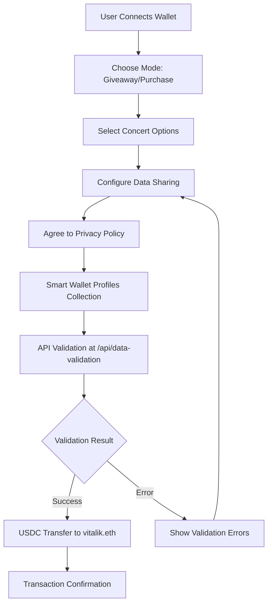

# 🎵 Clicket - Concert Ticket Marketplace & Giveaway

A comprehensive onchain concert ticket application built for **Base Builder Quest 6** that showcases Smart Wallet Profiles integration. Users can either enter a free giveaway or purchase tickets to amazing concerts, all while providing their personal information through Coinbase Smart Wallet with secure backend validation.

## 🎯 Overview

Clicket offers **two unique experiences**:

### 🎁 **Free Giveaway Mode**
- Enter a chance to win VIP concert tickets
- Small entry fee: **0.01 USDC** (sent to vitalik.eth)
- Win amazing prizes: VIP tickets, meet & greet, NFTs, merchandise

### 🎫 **Ticket Purchase Mode**  
- Browse 4 amazing concerts with real photos
- Purchase tickets for **1 USDC each** (sent to vitalik.eth)
- Instant ticket confirmation and delivery

## ✨ Key Features

### 🎪 **Dual Experience Design**
- **Home Screen** - Choose between giveaway or purchase
- **Concert Gallery** - Beautiful image gallery of 4 concerts
- **Smart Mode Switching** - Seamless navigation between experiences
- **Unified Privacy Policy** - Consistent data handling across modes

### 🎨 **Premium UI/UX**
- **Purple/Pink Gradient Theme** - Modern concert vibe
- **Glass Morphism Effects** - Backdrop blur and transparency
- **Concert Image Integration** - Real concert photos from `/public`
- **Responsive Design** - Perfect on all devices
- **Smooth Animations** - Hover effects and transitions

### 🔐 **Smart Wallet Profiles Integration**
- ✅ **Email Collection** - Winner notifications & ticket delivery
- ✅ **Name Collection** - Ticket registration & personalization
- ✅ **Physical Address** - Prize shipping & ticket mailing
- ✅ **Phone Number** - Optional urgent updates
- ✅ **Advanced Validation** - Enhanced backend API validation
- ✅ **Privacy Protection** - Comprehensive privacy policy integration

### 🎵 **Concert Lineup**
1. **Electric Nights** - DJ Thunder at Madison Square Garden
2. **Acoustic Sessions** - Sarah Mitchell at Brooklyn Bowl  
3. **Rock Revolution** - The Storm at Red Rocks Amphitheatre
4. **Jazz & Blues Night** - Marcus Johnson at Blue Note

Each concert features:
- High-quality concert photography
- Artist and venue information
- Date and pricing details
- Detailed descriptions

## 🚀 How It Works

### 📱 **User Journey**

1. **Connect Smart Wallet** - User connects Coinbase Smart Wallet
2. **Choose Experience** - Select giveaway entry or ticket purchase
3. **Browse/Select** - View concert options (purchase mode)
4. **Configure Data** - Choose what information to share
5. **Privacy Agreement** - Agree to privacy policy
6. **Smart Wallet Flow** - Wallet collects profile information
7. **API Validation** - Backend validates all data
8. **Transaction** - USDC sent to vitalik.eth
9. **Confirmation** - Success notification with details

### 🔄 **Technical Flow**



### 💰 **Payment Structure**

| Mode | Amount | Recipient | Purpose |
|------|--------|-----------|---------|
| 🎁 Giveaway | 0.01 USDC | vitalik.eth | Entry fee |
| 🎫 Purchase | 1 USDC | vitalik.eth | Ticket price |

## 🛠️ Technical Implementation

### 🎯 **Core Technologies**
- **Next.js 14** - React framework with App Router
- **Wagmi + Viem** - Ethereum interactions
- **Smart Wallet Profiles** - Coinbase profile data collection
- **Base Sepolia** - Blockchain network
- **Tailwind CSS** - Styling and animations
- **TypeScript** - Type safety

### 🔧 **Key Components**

#### **Frontend (`src/app/page.tsx`)**
- Multi-mode application (home/giveaway/purchase)
- Concert data management with image integration
- Smart Wallet integration with `useSendCalls`
- Privacy policy integration
- Comprehensive error handling

#### **API Endpoint (`src/app/api/data-validation/route.ts`)**
- Profile data validation for both modes
- Transaction type detection (0.01 vs 1 USDC)
- Enhanced error messaging
- CORS support
- Comprehensive logging

#### **Configuration (`src/wagmi.ts`)**
- Smart Wallet only configuration
- Base Sepolia network focus
- Optimized for profile collection

## 🎨 **Design System**

### 🌈 **Color Palette**
- **Primary**: Purple gradient (`from-purple-900 to-pink-800`)
- **Success**: Green (`from-green-500 to-emerald-600`)
- **Purchase**: Blue (`from-blue-500 to-indigo-600`)
- **Glass**: White with opacity (`bg-white/10`)

### 🎭 **Visual Elements**
- **Backdrop Blur**: Glass morphism effects
- **Gradients**: Multi-color backgrounds
- **Emojis**: Rich emoji integration
- **Typography**: Bold headings with gradient text
- **Cards**: Rounded corners with hover effects

## 🔒 **Privacy & Security**

### 📋 **Data Collection**
We collect information based on user selection:
- **Email**: Required for both modes
- **Name**: Required for ticket registration
- **Physical Address**: Required for shipping/mailing
- **Phone**: Optional for urgent updates

### 🛡️ **Privacy Protection**
- ✅ **Explicit Consent** - Checkbox agreement required
- ✅ **Clear Purpose** - Specific use cases explained  
- ✅ **Privacy Policy Link** - Direct link to policy page
- ✅ **Data Minimization** - Only collect what's needed
- ✅ **Secure Validation** - Backend data validation
- ✅ **Transparent Usage** - Clear communication about data use

### 🔐 **Security Measures**
- **HTTPS Required** - All endpoints use HTTPS
- **Input Validation** - Comprehensive data validation
- **Error Handling** - Graceful error management
- **CORS Configuration** - Proper cross-origin setup
- **Type Safety** - Full TypeScript implementation

## 🚀 **Getting Started**

### 📋 **Prerequisites**
- Node.js 18+
- Bun package manager  
- ReOwn Project ID
- Coinbase Developer Platform API Key
- ngrok for HTTPS tunnel

### ⚙️ **Environment Setup**

1. **Install dependencies:**
```bash
cd onchain-app-template
bun install
```

2. **Configure environment:**
```env
NEXT_PUBLIC_CDP_API_KEY=your_coinbase_api_key
NEXT_PUBLIC_WC_PROJECT_ID=your_reown_project_id
NEXT_PUBLIC_ENVIRONMENT=development
```

3. **Start development:**
```bash
bun run dev
```

4. **Setup HTTPS tunnel:**
```bash
ngrok http 3000
```

5. **Update callback URL:**
Update the ngrok URL in `src/app/page.tsx`:
```typescript
function getCallbackURL() {
  return "https://your-ngrok-url.ngrok-free.app/api/data-validation";
}
```

## 🧪 **Testing Guide**

### 🎯 **Test Scenarios**

#### **Giveaway Mode Testing**
1. Connect Smart Wallet
2. Select "Free Giveaway"
3. Configure data options
4. Agree to privacy policy
5. Complete 0.01 USDC transaction
6. Verify profile data collection

#### **Purchase Mode Testing**
1. Connect Smart Wallet
2. Select "Buy Tickets"
3. Browse concert options
4. Select a concert
5. Configure data options
6. Complete 1 USDC transaction
7. Verify ticket purchase flow

#### **Validation Testing**
- Test with invalid email formats
- Test with missing required fields
- Test without privacy policy agreement
- Test network switching (non-Base Sepolia)

## 📊 **Base Builder Quest 6 Compliance**

This project exceeds all Base Builder Quest 6 requirements:

✅ **Smart Wallet Profiles** - Full integration with data collection  
✅ **Data Callback API** - Advanced validation endpoint  
✅ **Privacy Policy** - Comprehensive privacy protection  
✅ **User Consent** - Explicit agreement mechanisms  
✅ **Onchain Component** - USDC transactions to vitalik.eth  
✅ **Base Network** - Built on Base Sepolia  

### 🏆 **Bonus Features**
- 🎵 **Dual Experience** - Giveaway AND purchase modes
- 🎨 **Premium Design** - Professional UI/UX
- 📱 **Concert Gallery** - Real concert imagery
- 🔄 **Smart Mode Switching** - Seamless navigation
- 📊 **Transaction Detection** - API recognizes transaction types
- 🛡️ **Enhanced Security** - Advanced validation and error handling

## 🔗 **Live Demo**

- **Application**: `http://localhost:3000` (after setup)
- **API Endpoint**: `https://877b-178-235-179-3.ngrok-free.app/api/data-validation`
- **Test Endpoint**: `https://877b-178-235-179-3.ngrok-free.app/api/test`

## 📁 **Project Structure**

```
onchain-app-template/
├── src/
│   ├── app/
│   │   ├── page.tsx                 # Main application
│   │   ├── layout.tsx              # App layout
│   │   ├── global.css              # Global styles
│   │   ├── privacy/page.tsx        # Privacy policy
│   │   └── api/
│   │       ├── data-validation/    # Profile validation API
│   │       ├── profile-verification/ # Legacy endpoint
│   │       └── test/               # Test endpoint
│   ├── components/                 # React components
│   ├── wagmi.ts                   # Wagmi configuration
│   └── config.ts                  # App configuration
├── public/
│   ├── image.jpg                  # Concert photo 1
│   ├── image2.jpg                 # Concert photo 2  
│   ├── image3.jpg                 # Concert photo 3
│   └── image4.jpg                 # Concert photo 4
└── README.md                      # This file
```

## 🤝 **Contributing**

1. Fork the repository
2. Create feature branch
3. Make changes
4. Test thoroughly
5. Submit pull request

## 📄 **License**

MIT License - see LICENSE file for details.

## 🙏 **Acknowledgments**

- **Base Team** - Smart Wallet Profiles technology
- **Coinbase** - Smart Wallet infrastructure  
- **OnchainKit** - Development tools and templates
- **Community** - Testing and feedback

---

**Built with ❤️ for Base Builder Quest 6** 🏆

*Experience the future of concert ticketing with blockchain technology!* 🎵✨
# Clicket

